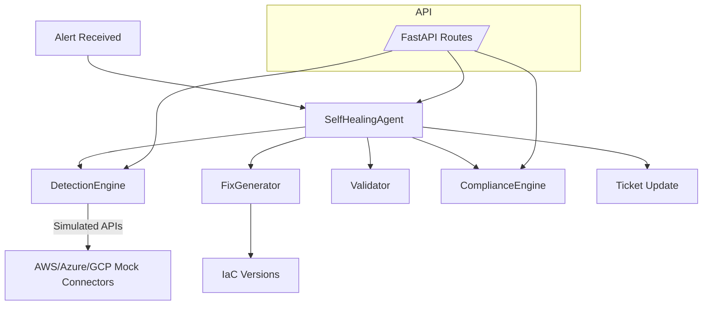

# ASCIA - Autonomous Self-Healing Cloud Infrastructure Agent

ASCIA is a simulated, production-ready platform for detecting cloud misconfigurations, generating IaC remediations, and mapping outcomes to compliance controls—all without touching real cloud environments. It demonstrates autonomous remediation loops with FastAPI, modular engines, and mock multi-cloud connectors.

## Highlights
- **Multi-cloud detection** for common risks: public storage, open security groups, IAM escalation, missing MFA, unencrypted storage, KMS drift, and vulnerable runtimes.
- **Autonomous agent loop** (LangGraph-style) with validation, planning, application, verification, and ticket updates.
- **Safe IaC remediation**: Terraform snippets written to `iac_versions/` with validation hooks and replayable history.
- **Governance mapping** to ACSC Essential Eight, SOCI Act, and ISO/IEC 42001, plus risk scoring.
- **FastAPI backend & dashboard** endpoints for alerts, detection, compliance, fixes, and health checks.
- **Comprehensive logging** to `logs/app.log` and deterministic mock connectors (AWS, Azure, GCP).

## Architecture


## Repository Layout
```
backend/
  api/            # FastAPI routers
  agents/         # LangGraph-style agent
  engines/        # Detection, fix generation, validation, compliance
  utils/          # Logging helpers
  models.py       # Shared pydantic models
connectors/       # Simulated AWS/Azure/GCP connectors
frontend/         # Static dashboard assets
iac_versions/     # Generated Terraform fixes (git-kept, no secrets)
logs/             # Application logs (git-kept, rotate via logging utils)
docs/             # Architecture, API reference, and design notes
examples/         # Ready-to-use alert payloads
```

## Getting Started
1. **Create environment & install**
   ```bash
   python -m venv .venv
   source .venv/bin/activate
   pip install -e .[dev]
   ```
2. **Run the API**
   ```bash
   uvicorn backend.main:app --reload
   ```
3. **Open the dashboard**
   Serve `frontend/` (e.g., `python -m http.server 8001`) and point it at the API base URL.
4. **Devcontainer (optional)**
   Open the repository in VS Code and select "Reopen in Container" to use the preconfigured Python 3.11 environment.

## API Surface
Key endpoints (see [docs/API.md](docs/API.md) for full payloads and responses):
- `POST /alert` – Ingest and acknowledge alerts.
- `POST /run_agent` – Execute the autonomous remediation loop for an alert.
- `GET /issues` – List currently detected misconfigurations.
- `POST /fix` – Generate and validate an IaC fix for supplied issues.
- `GET /fix/latest` – Retrieve the latest stored IaC plan.
- `GET /compliance` – View compliance mapping and risk score.
- `GET /dashboard` – Aggregated issues, compliance, and latest fix snapshot.
- `GET /health` – Health probe.

## Usage Examples
- Kick off the remediation loop with the included payload:
  ```bash
  curl -X POST http://localhost:8000/run_agent \
    -H 'Content-Type: application/json' \
    -d @examples/alert_public_storage.json
  ```
- Fetch the latest IaC plan for review:
  ```bash
  curl http://localhost:8000/fix/latest
  ```
- View compliance posture:
  ```bash
  curl http://localhost:8000/compliance
  ```
More operational guidance is available in [docs/OPERATIONS.md](docs/OPERATIONS.md).

## Compliance & Safety
- **Frameworks**: ACSC Essential Eight, SOCI Act (AU), ISO/IEC 42001.
- **Safety**: No real cloud calls or credentials. All connectors are deterministic mocks; IaC execution is local and logged.
- **Auditability**: Every remediation plan is versioned in `iac_versions/`; runtime logs are in `logs/app.log`.

## Testing & Quality
Run the full test suite:
```bash
pytest
```

Lint with Ruff:
```bash
ruff check .
```

## Contributing
See [CONTRIBUTING.md](CONTRIBUTING.md) for coding standards, security guidance, and workflow. A standard MIT [LICENSE](LICENSE) applies. For vulnerabilities, follow [SECURITY.md](SECURITY.md). Community expectations are set in [CODE_OF_CONDUCT.md](CODE_OF_CONDUCT.md).

## Demo Scenarios
- Trigger `/run_agent` with an alert containing `"issue_type": "Publicly exposed storage"` to observe detection, fix generation, and compliance mapping.
- Check `/dashboard` to view aggregated risk score, mapped controls, and the latest Terraform plan.

## Project Status
This repository is designed for educational and demo purposes. All infrastructure interactions are **simulated** and safe to run locally.
