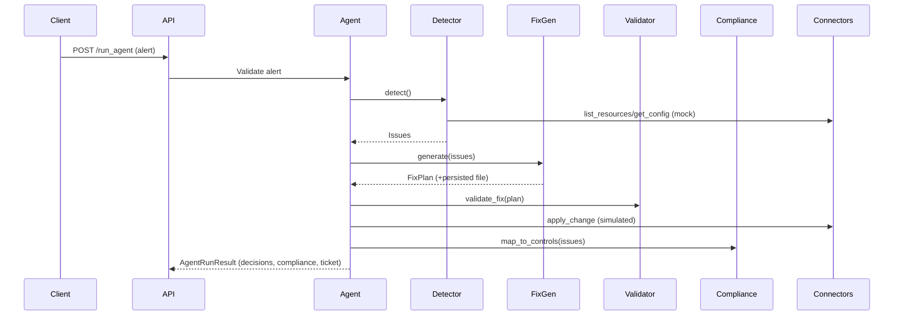

# Architecture & Design

ASCIA is structured with clean separation between API transport, decision engines, and cloud connectors to keep the simulated environment deterministic and replayable.

## Component Overview
- **FastAPI layer** (`backend/api/*`): HTTP routes for alerts, detection, remediation, compliance, and health.
- **Agent core** (`backend/agents/self_healing_agent.py`): LangGraph-style loop orchestrating validation, detection, planning, application, and ticket updates.
- **Engines** (`backend/engines/*`):
  - `DetectionEngine` scans mock connectors for misconfigurations.
  - `FixGenerator` produces Terraform snippets and persists versioned plans.
  - `Validator` performs lightweight plan validation.
  - `ComplianceEngine` maps issues to ACSC Essential Eight, SOCI Act, and ISO/IEC 42001 with risk scoring.
- **Connectors** (`connectors/*`): Deterministic mock SDKs for AWS, Azure, and GCP implementing `list_resources`, `get_config`, `apply_change`, and `simulate_failure`.
- **Frontend** (`frontend/*`): Static dashboard consuming `/issues`, `/compliance`, and `/fix/latest`.

## Data Flow

## Threat Model (Simulated)
- **Data exposure**: Avoided by using local mock connectors; no credentials or real endpoints.
- **Privilege escalation**: IAM remediation enforces least-privilege templates and MFA simulation.
- **Network exposure**: Security group fixes restrict ingress to trusted CIDRs.
- **Misconfiguration drift**: Idempotent Terraform snippets stored under `iac_versions/` for replay and audit.
- **Auditability**: Decision logs and rotating file logging in `logs/app.log` capture every step.

## IaC Pipeline
1. Issues are transformed into Terraform snippets by `FixGenerator`.
2. Plans are validated via `Validator` (stubbed for demo; ready for linters/policy-as-code tools).
3. Files are written to `iac_versions/` with timestamps for versioning.
4. Connectors receive `apply_change` calls with plan context for simulated enforcement.

## Extensibility
- Plug additional connectors by implementing `list_resources`, `get_config`, `apply_change`, and `simulate_failure`.
- Swap Terraform snippets for Pulumi or Python SDK calls within `FixGenerator` while retaining validation and storage steps.
- Integrate real compliance engines or OPA policies by extending `ComplianceEngine`.
